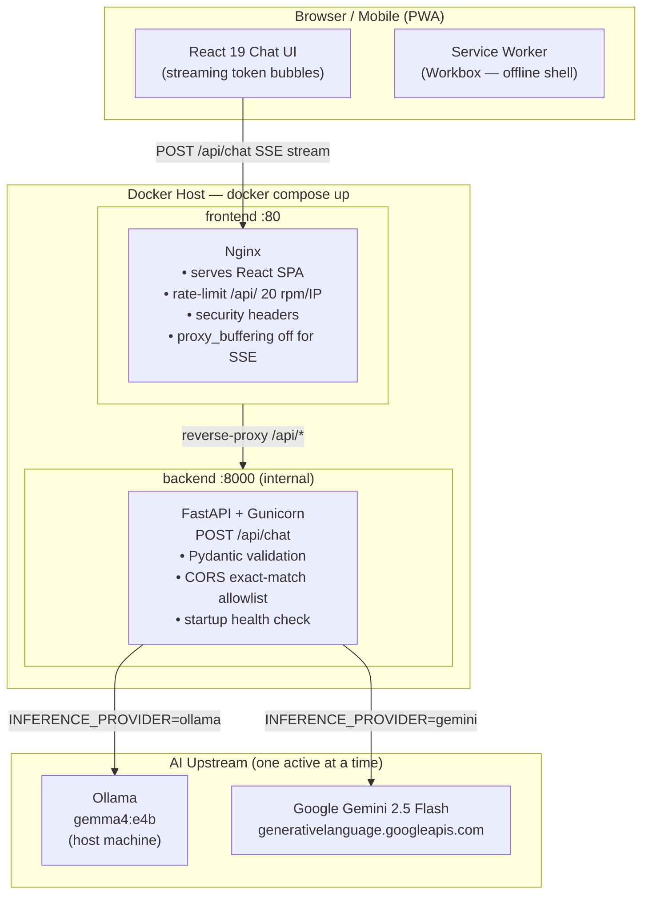
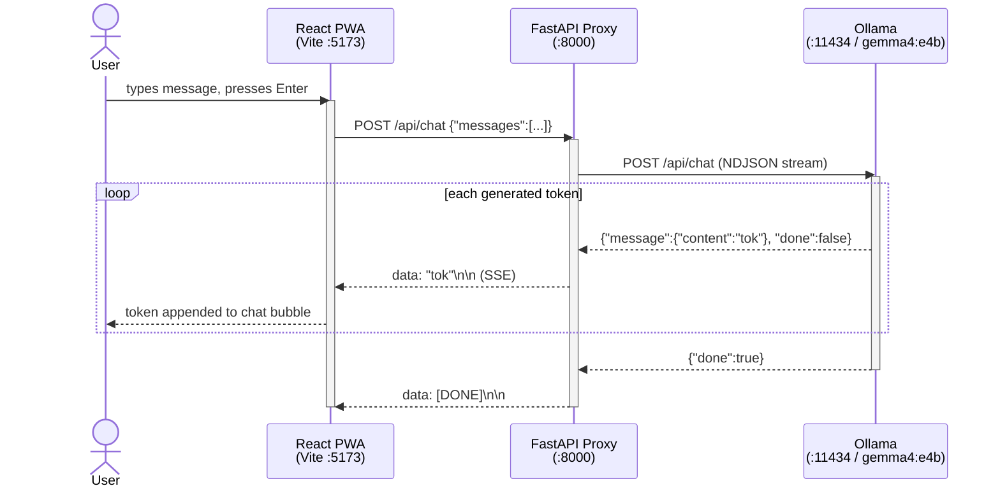
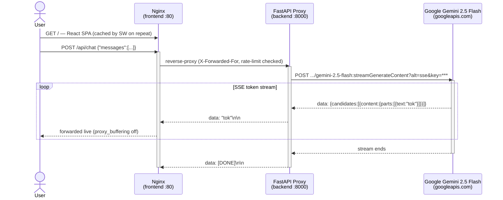
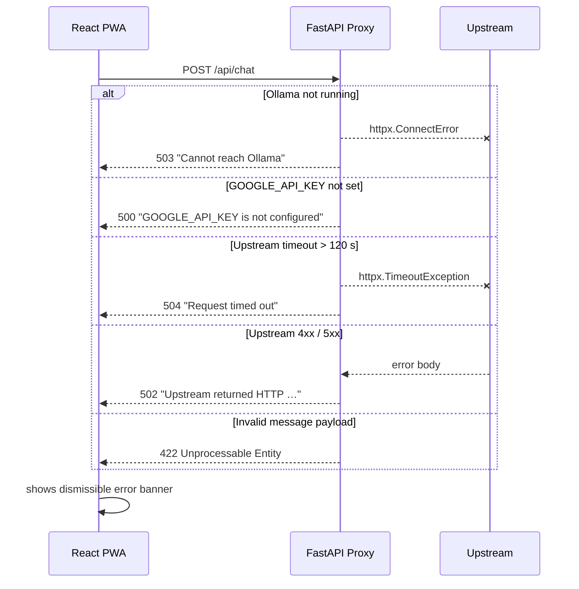
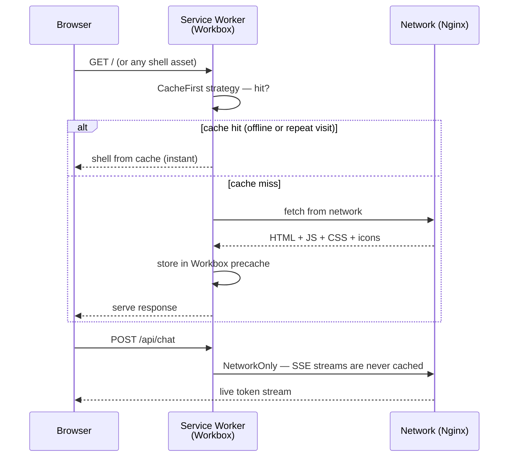
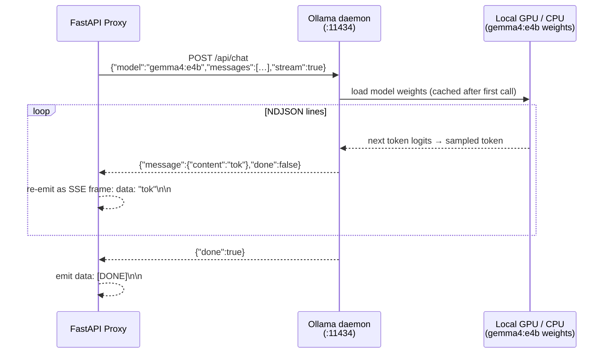
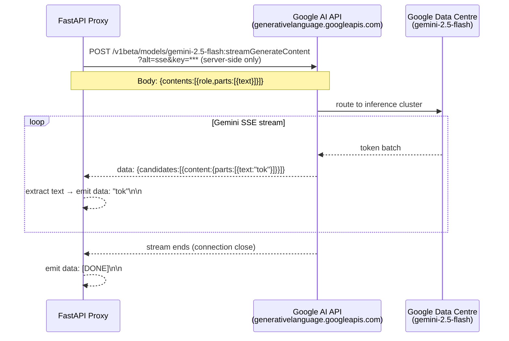

# Hybrid Inference Chat

A **mobile-first Progressive Web App (PWA)** for LLM inference that streams AI responses token-by-token. It implements a **hybrid inference pattern**: routing requests to a **local Ollama model** (on-device, zero latency, zero cost) in development, and to **Google Gemini 2.5 Flash** (cloud-hosted, scalable) in production — all through a secure FastAPI proxy so API keys never reach the browser.

The architecture is built around one core idea: **the client never talks to an AI provider directly**. Every token flows through the backend proxy, which normalises the wire format, enforces CORS, validates input, and decides which upstream to call based on a single environment variable.

---

## LLM Inference Use Cases

### Why hybrid inference?

Most applications need two things that are in tension:
- **Fast, free iteration** during development (local model, no API cost, works offline)
- **High-quality, scalable inference** in production (cloud model, managed capacity)

This project solves that by making the inference provider a **runtime config switch**, not a code branch.

```
INFERENCE_PROVIDER=ollama  →  gemma4:e4b runs on your machine    (dev / air-gapped)
INFERENCE_PROVIDER=gemini  →  Gemini 2.5 Flash runs on Google    (production / cloud)
```

No code changes. No rebuild. Same API contract for the frontend.

### Who is this for?

| Persona | Problem solved |
|---|---|
| **ML / AI developer** | Prompt-engineer and iterate locally against `gemma4:e4b` at zero cost, then validate the same prompts against Gemini in one command |
| **Backend engineer** | Add LLM streaming to an existing product without exposing API keys to the browser or building a streaming proxy from scratch |
| **DevOps / platform team** | Ship the full stack as a single `docker compose up` — Nginx, FastAPI proxy, and model routing included |
| **Privacy-first deployment** | Run entirely on-device with Ollama; no data ever leaves the host |
| **Prototyping / hackathon** | Working streaming chat UI + secure proxy in minutes; swap the model by editing one line |

### Inference scenarios covered

| Scenario | Config | Model |
|---|---|---|
| Local development | `INFERENCE_PROVIDER=ollama` | `gemma4:e4b` via Ollama |
| Air-gapped / offline | `INFERENCE_PROVIDER=ollama` | Any `ollama pull`-ed model |
| Cloud production | `INFERENCE_PROVIDER=gemini` | `gemini-2.5-flash` |
| Experimenting with other Gemini models | `GEMINI_MODEL=gemini-2.5-pro` | Any `/v1beta/models` model |
| Custom local model | `OLLAMA_MODEL=llama3.1:8b` | Any Ollama model tag |

---

## High-Level Design (HLD)



### Component map

| Layer | Technology | Responsibility |
|---|---|---|
| **React PWA** | React 19, Vite, Tailwind CSS v4 | Streaming chat UI; Workbox service worker for offline shell |
| **Nginx** | nginx 1.27-alpine | Static SPA serving, `/api/*` reverse-proxy, rate-limiting, security headers, gzip |
| **FastAPI proxy** | Python 3.12, Gunicorn + uvicorn workers | Request validation, upstream fan-out, SSE normalisation |
| **Ollama** | Host-side process | Runs `gemma4:e4b` on-device; zero external traffic |
| **Google Gemini** | Google Cloud | `gemini-2.5-flash` via REST; API key kept server-side only |

---

## How It Works

### Unified SSE protocol

The backend presents one endpoint regardless of which model answers:

```
POST /api/chat
Content-Type: application/json

{ "messages": [{ "role": "user", "content": "Hello" }] }
```

Response — `text/event-stream`:
```
data: "Hello"

data: ", "

data: "world!"

data: [DONE]
```

The React client iterates an `AsyncGenerator<string>` — it has no knowledge of which provider is active.

### Provider switching (zero code change)

```
INFERENCE_PROVIDER=ollama  →  POST http://ollama:11434/api/chat  (NDJSON → normalised SSE)
INFERENCE_PROVIDER=gemini  →  POST googleapis.com/…:streamGenerateContent?alt=sse  (SSE → SSE)
```

### Streaming pipeline

```
Ollama NDJSON chunks  ──►  FastAPI normaliser  ──►  SSE frames  ──►  Nginx (buffering OFF)  ──►  Browser
Gemini SSE frames     ──►  FastAPI pass-through ──►  SSE frames  ──►  Nginx (buffering OFF)  ──►  Browser
```

---

## Sequence Diagrams

### 1 — Local development (Ollama)



### 2 — Production (Docker Compose + Gemini)



### 3 — Error handling



### 4 — PWA offline / Service Worker caching



---

## Prerequisites

| Tool | Version | Purpose |
|---|---|---|
| Python | ≥ 3.11 | Backend proxy |
| Node.js | ≥ 20 | Frontend build |
| [Ollama](https://ollama.com) | latest | Local inference (dev only) |
| Docker + Compose plugin | ≥ 24 | Production deployment |

---

## Quick Start — Local Development (Ollama)

### 1. Pull the model

```bash
ollama pull gemma4:e4b   # ~3 GB, one-time download
ollama serve             # starts on http://localhost:11434
```

### 2. Start the backend

```bash
cd backend

python3.11 -m venv .venv && source .venv/bin/activate
pip install -r requirements.txt

# backend/.env is pre-configured: INFERENCE_PROVIDER=ollama, OLLAMA_MODEL=gemma4:e4b
uvicorn main:app --reload --port 8000
```

Verify: `curl http://localhost:8000/health`
→ `{"status":"ok","provider":"ollama"}`

### 3. Start the frontend

```bash
cd frontend
npm install
npm run dev          # http://localhost:5173
```

Header shows **Local · Gemma4 E4B via Ollama**. Type a message and watch tokens stream in.

---

## Production — Docker Compose (Gemini)

### 1. Get a Gemini API key

[aistudio.google.com/app/apikey](https://aistudio.google.com/app/apikey) → Create API key.

### 2. Configure

```bash
cp .env.example .env
```

Edit `.env`:

```dotenv
INFERENCE_PROVIDER=gemini
GOOGLE_API_KEY=your_key_here
GEMINI_MODEL=gemini-2.5-flash
FRONTEND_ORIGIN=http://localhost    # or https://yourdomain.com in production
PORT=80
```

### 3. Build and run

```bash
docker compose up --build
```

Open [http://localhost](http://localhost) — header shows **Cloud · Gemini 2.5 Flash**.

### 4. Stop

```bash
docker compose down
```

---

## Switching Provider (no rebuild required)

The provider is resolved at **runtime**, so you can switch a running stack without rebuilding images:

```bash
# Switch to Gemini
INFERENCE_PROVIDER=gemini GOOGLE_API_KEY=… docker compose up -d

# Switch back to Ollama (via host machine's Ollama daemon)
INFERENCE_PROVIDER=ollama docker compose up -d
```

---

## Environment Variables

### Backend (`backend/.env`)

| Variable | Default | Description |
|---|---|---|
| `INFERENCE_PROVIDER` | `ollama` | `ollama` or `gemini` |
| `GOOGLE_API_KEY` | — | Required when provider is `gemini` |
| `GEMINI_MODEL` | `gemini-2.5-flash` | Any model listed at `/v1beta/models` |
| `OLLAMA_BASE_URL` | `http://localhost:11434` | Ollama server URL |
| `OLLAMA_MODEL` | `gemma4:e4b` | Any `ollama pull`-ed model tag |
| `FRONTEND_ORIGIN` | `http://localhost:5173` | CORS-allowed origin (exact match, no trailing slash) |

### Frontend (`frontend/.env`)

| Variable | Default | Description |
|---|---|---|
| `VITE_API_URL` | `http://localhost:8000` | Backend URL. Leave empty in Docker — Nginx handles routing |

### Docker Compose (root `.env`)

All backend vars above, plus:

| Variable | Default | Description |
|---|---|---|
| `PORT` | `80` | Host port exposed by the frontend Nginx container |

---

## Project Structure

```
hybrid-inference-app/
├── backend/
│   ├── main.py              # FastAPI app — CORS, lifespan startup check, structured logging
│   ├── routers/
│   │   └── inference.py     # POST /api/chat — Pydantic models, Ollama + Gemini stream helpers
│   ├── requirements.txt     # fastapi, uvicorn[standard], gunicorn, httpx, python-dotenv
│   ├── Dockerfile           # python:3.12-slim → non-root user → gunicorn 2 workers
│   └── .env.example
│
├── frontend/
│   ├── src/
│   │   ├── App.tsx           # Root layout: header, error banner, chat area, input bar
│   │   ├── components/
│   │   │   ├── ChatThread.tsx # Message list, auto-scroll, streaming cursor animation
│   │   │   └── InputBar.tsx   # Auto-grow textarea, Enter-to-send, loading spinner
│   │   ├── hooks/
│   │   │   └── useChat.ts    # Optimistic UI, token accumulation, error recovery
│   │   └── services/
│   │       └── api.ts        # AsyncGenerator SSE client (fetch + ReadableStream)
│   ├── nginx.conf            # SPA fallback, /api/ reverse-proxy, rate-limit, gzip
│   ├── Dockerfile            # node:22 build stage → nginx:1.27-alpine serve stage
│   ├── vite.config.ts        # Vite + Tailwind CSS v4 + vite-plugin-pwa (Workbox)
│   └── .env.example
│
├── docker-compose.yml        # Two services: backend (internal) + frontend (port 80)
├── .env.example              # Root template for docker-compose
└── README.md
```

---

## Security

| Control | Implementation |
|---|---|
| **API key isolation** | Key lives only in the backend process env — never sent to browser |
| **CORS strict allowlist** | Exact origin match; `*` is never used |
| **Docs disabled in production** | `/docs` and `/openapi.json` return 404 when `INFERENCE_PROVIDER=gemini` |
| **Rate limiting** | Nginx `limit_req_zone`: 20 req/min per IP, burst 5 |
| **Non-root container** | Backend runs as `appuser` (not root) inside Docker |
| **Input validation** | Pydantic rejects blank content, unknown roles, and empty message lists before any upstream call |
| **No key in logs** | Structured logs never print `GOOGLE_API_KEY` |
| **SSE not cached** | Workbox `NetworkOnly` strategy for `/api/*` — no token leakage via cache |

---

## Inference Server Deep-Dive

### Ollama + Gemma4 E4B (local inference server)

Ollama acts as a **local OpenAI-compatible inference server** that runs entirely on your machine. When `INFERENCE_PROVIDER=ollama` the FastAPI proxy talks to it over `http://localhost:11434`.

#### How the request flows



#### Gemma4 E4B model facts

| Property | Value |
|---|---|
| Model family | Gemma 4 (Google DeepMind) |
| Variant | `e4b` — 4-bit quantised, ~3 GB on disk |
| Context window | 8 192 tokens |
| Strengths | Instruction following, coding, reasoning |
| Hardware requirement | 8 GB RAM minimum; GPU optional (falls back to CPU) |
| Privacy | 100% on-device — zero external network calls |

#### Wire format — Ollama NDJSON

Ollama streams newline-delimited JSON. The proxy reads each line, extracts `message.content`, and re-wraps it as an SSE frame:

```
# Ollama raw output (one JSON object per line)
{"model":"gemma4:e4b","message":{"role":"assistant","content":"Hello"},"done":false}
{"model":"gemma4:e4b","message":{"role":"assistant","content":" there"},"done":false}
{"model":"gemma4:e4b","done":true,"total_duration":1234567}

# Normalised SSE output (what the browser receives)
data: "Hello"\n\n
data: " there"\n\n
data: [DONE]\n\n
```

#### Ollama setup commands

```bash
# Install (macOS)
brew install ollama

# Start the inference daemon
ollama serve                   # http://localhost:11434

# Pull the model (one-time, ~3 GB)
ollama pull gemma4:e4b

# Verify it responds
curl http://localhost:11434/api/chat \
  -d '{"model":"gemma4:e4b","messages":[{"role":"user","content":"ping"}],"stream":false}'

# List all downloaded models
ollama list

# Switch to a different local model (no code change needed)
OLLAMA_MODEL=llama3.1:8b uvicorn main:app --reload --port 8000
```

---

### Google Gemini 2.5 Flash (cloud inference server)

When `INFERENCE_PROVIDER=gemini` the proxy forwards requests to the **Google Generative Language API** over HTTPS. The API key stays server-side.

#### How the request flows



#### Gemini 2.5 Flash model facts

| Property | Value |
|---|---|
| Model family | Gemini 2.5 (Google DeepMind) |
| Variant | Flash — optimised for speed and cost |
| Context window | 1 048 576 tokens (1M) |
| Strengths | Long-context, multimodal reasoning, instruction following |
| Latency | First token typically < 500 ms |
| Cost | Pay-per-token via Google AI Studio |
| Privacy | Data processed by Google; review their [data policy](https://ai.google.dev/gemini-api/terms) |

#### Wire format — Gemini SSE

Gemini natively streams SSE when `?alt=sse` is appended. The proxy extracts the text token from the nested candidate structure:

```
# Gemini raw SSE line
data: {"candidates":[{"content":{"parts":[{"text":"Hello"}],"role":"model"},"index":0}]}

# Normalised SSE output (what the browser receives)
data: "Hello"\n\n
data: [DONE]\n\n
```

#### Getting and rotating API keys

```bash
# 1. Create a key at Google AI Studio
open https://aistudio.google.com/app/apikey

# 2. Set it in backend/.env (never commit this file)
echo "GOOGLE_API_KEY=your_key_here" >> backend/.env

# 3. List available models for your key
curl -s "https://generativelanguage.googleapis.com/v1beta/models?key=$GOOGLE_API_KEY" \
  | python3 -c "import json,sys; [print(m['name']) for m in json.load(sys.stdin)['models']]"

# 4. Switch model without rebuild
GEMINI_MODEL=gemini-2.5-pro docker compose up -d
```

#### Comparing the two inference backends

| | Ollama + Gemma4 E4B | Google Gemini 2.5 Flash |
|---|---|---|
| **Cost** | Free (electricity only) | Pay-per-token |
| **Privacy** | 100% on-device | Google processes data |
| **Latency** | Depends on local hardware | ~500 ms first token |
| **Context window** | 8 192 tokens | 1 048 576 tokens |
| **Offline capable** | Yes | No |
| **Setup** | `ollama pull gemma4:e4b` | Google AI Studio API key |
| **Best for** | Dev, testing, private data | Production, long context, quality |

---

## Contributing

Contributions are welcome! Here's how to get started:

### Workflow

```bash
# 1. Fork the repo and clone your fork
git clone https://github.com/<your-username>/hybrid-inference-app.git
cd hybrid-inference-app

# 2. Create a feature branch off main
git checkout -b feat/your-feature-name

# 3. Set up local dev environment
cd backend && python3.11 -m venv .venv && source .venv/bin/activate && pip install -r requirements.txt
cd ../frontend && npm install

# 4. Make your changes, then verify nothing is broken
cd backend && uvicorn main:app --reload --port 8000 &
cd ../frontend && npm run build   # must produce 0 errors

# 5. Commit using conventional commits
git commit -m "feat: add streaming abort support"
git commit -m "fix: handle empty Gemini candidate list"
git commit -m "docs: add custom model guide"

# 6. Push and open a PR against main
git push origin feat/your-feature-name
```

### Conventional commit prefixes

| Prefix | When to use |
|---|---|
| `feat:` | New feature |
| `fix:` | Bug fix |
| `docs:` | Documentation only |
| `chore:` | Build, deps, tooling |
| `refactor:` | Code change with no behaviour change |
| `test:` | Adding or fixing tests |

### Good first contributions

- Add a system-prompt field to the UI
- Support abort/cancel of an in-flight stream
- Add a model selector dropdown
- Add end-to-end tests (Playwright)
- Add support for a third upstream (e.g. Anthropic Claude via Bedrock)

### Code style

- **Python** — PEP 8; type annotations on all public functions; Pydantic for all I/O boundaries
- **TypeScript** — strict mode; no `any`; prefer `const`
- Keep PRs focused: one concern per PR

---

## License

MIT © 2026 [Htunn](https://github.com/Htunn)

See [LICENSE](LICENSE) for the full text.
